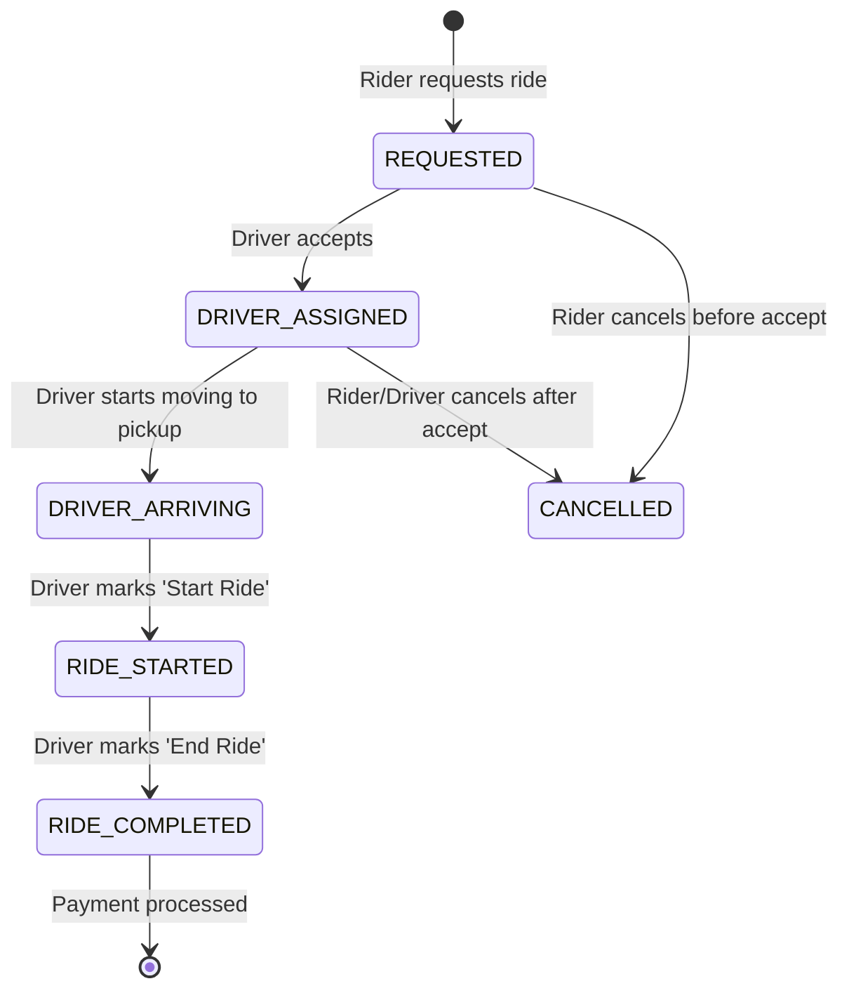

## 📱 Visual Overview

  
  
  
  

## Business Overview
This repository contains the architecture and core implementation for a production-grade ride-hailing platform (similar to Uber/Ola). The system is designed to handle **1m+ users** with a dual-app strategy (Rider & Driver), a real-time matching engine, and automated Stripe Connect payouts.

## 🏗 System Architecture
The project follows **Clean Architecture** principles to ensure separation of concerns, testability, and scalability. All core assets are located in the `assets/` directory.

- **Rider App**: Focused on ride requests, real-time tracking, and payments.
- **Driver App**: Focused on onboarding, document management, earning dashboards, and ride execution.
- **Admin Panel**: Centralized monitoring for driver approvals, revenue tracking, and system health.
- **Backend Services**: Node.js/Go microservices for matching, location streaming, and Stripe webhooks.
- **Matching Engine**: Geo-indexed (Redis) lookup for nearest available drivers with expansion logic.
- **Payment Service**: Stripe Connect Express integration for automated 80/20 payment splits.

## 👨‍✈️ Driver Onboarding Flow
1. **Registration**: Upload driver's license, vehicle details, and insurance. (Status: `PENDING_VERIFICATION`).
2. **Stripe Connect**: Create an Express account and redirect users for bank verification.
3. **Webhook**: Listen for `account.updated`. If bank details are complete -> Set `stripe_status = VERIFIED`.
4. **Admin Approval**: Administrator reviews documents and sets driver status to `APPROVED`.
5. **Go Online**: Once `APPROVED` and `VERIFIED`, the driver can toggle to `ONLINE`.

## 🧍 Rider Booking Flow
1. **Request**: Rider selects destination and pickup, views fare estimate.
2. **Match**: Matching Engine selects the nearest driver (5km radius, expansion up to 15km).
3. **Accept**: Driver receives socket event and accepts the ride.
4. **Track**: Rider tracks driver in real-time (Location update: 3-5 seconds).
5. **Complete**: Ride ends, payment is captured, and split 80% to driver/20% to platform.

## 🔁 Ride Lifecycle Diagram

## 📍 Location Update Strategy (Dynamic Throttling)
To optimize server load and battery consumption, we use dynamic throttling:
- **OFFLINE**: No tracking.
- **ONLINE (Idle)**: Every 60 seconds (Battery efficiency).
- **DRIVER_ASSIGNED**: Every 5 seconds (Real-time accuracy for pickup).
- **RIDE_STARTED**: Every 3–5 seconds (Critical precision for route calculation).

## ⚡ Matching Engine Design
- **Geo-Radius Search**: Uses Redis `GEORADIUS` for sub-millisecond lookups.
- **Proximity Sort**: Priority given to the closest driver.
- **Timeout Logic**: Each driver has 30 seconds to respond before the request moves to the next candidate.
- **Fallback**: Radius expands by 5km recursively until a driver is found.

## 💳 Payment Split Architecture
Integrated with **Stripe Connect Express**:
- **80% Driver Transfer**: Funds move directly to the driver's Stripe balance.
- **20% Platform Fee**: Kept as commission.
- **Automated Payouts**: Handled by Stripe based on the driver's payout schedule.

## 📊 Scalability Strategy
- **Horizontal Scaling**: Stateless API servers can be scaled behind an Nginx load balancer.
- **WebSocket Clustering**: Using Redis Pub/Sub to synchronize socket events across multi-pod clusters.
- **Redis Geo-Indexing**: Efficient spatial queries for 1M+ active locations.
- **Event-Driven**: Decoupled services communicating via RabbitMQ/Kafka for ride events.

## 🛠 Tech Stack
- **Mobile**: Flutter (Client-side)
- **State Management**: BLoC or GetX
- **Backend**: Node.js (Microservices)
- **Real-time**: WebSocket (Socket.io)
- **Database**: PostgreSQL (Relational) + Redis (Geo/Cache)
- **Payments**: Stripe Connect Express
- **Infrastructure**: Docker, K8s, AWS/GCP

## 📞 Contact & Opportunities
**Aditya Verma** – Flutter Developer | Mobile App Developer | Building Scalable Apps & MVPs for Startups  
Helping startups & companies build **scalable, real-time, high-performance apps**

📧 Email: adityaverma15.cs@gmail.com  
🔗 LinkedIn: https://www.linkedin.com/in/adityav-dev/  
🌐 Portfolio: https://www.adityaverma.dev/  
📝 Medium: https://adityaverma-dev.medium.com/  
🐦 X: https://x.com/adityavdev  
  
- 🌍 Open to Remote Projects, Collaborations & Full-Time Opportunities 

